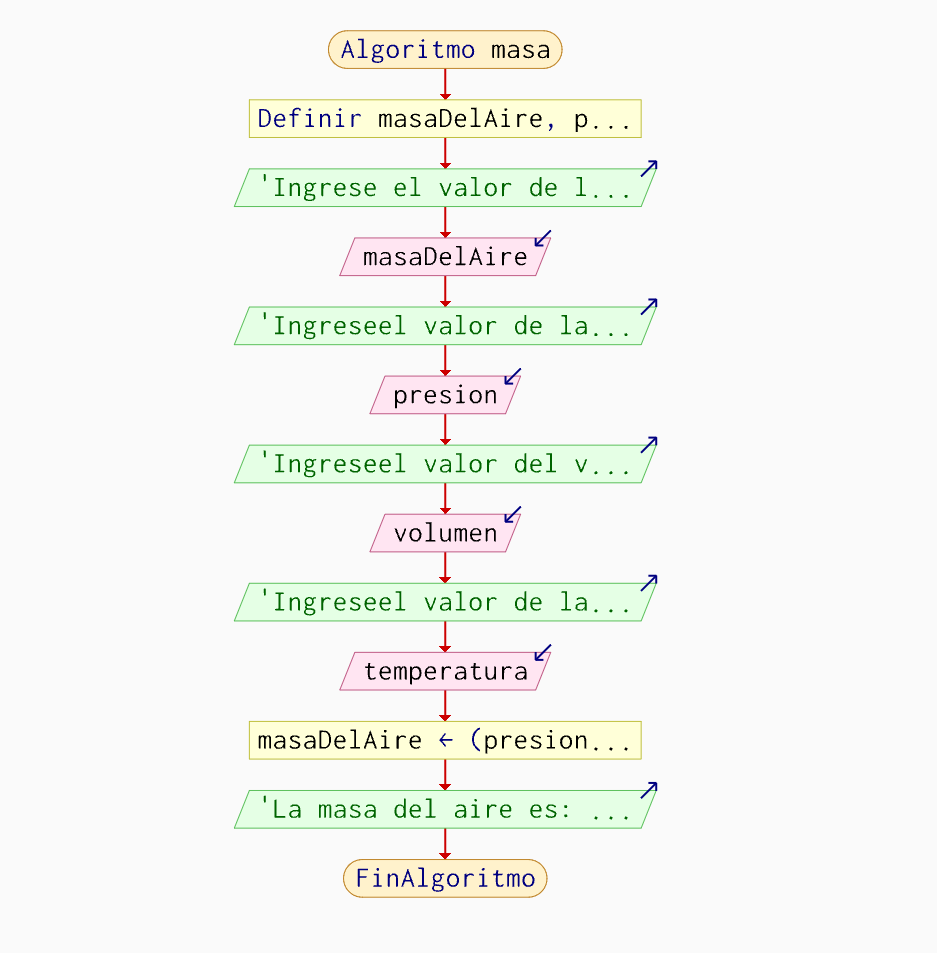

# 🧩 Unidad 1 — Algoritmos y Estructuras Secuenciales

### 📘 Contenidos de la Unidad
- **Conceptos básicos:** Algoritmos, pseudocódigo y diagramas de flujo.
- **Programación por bloques.**
- **Ejemplos con estructuras lineales/secuenciales.**
- **Dificultades encontradas.**
- **Reflexión crítica sobre los aprendizajes.**

---

## 🔹 Algoritmos, Pseudocódigo y Diagrama de Flujo
📄 **Definiciones y explicación:**  
➡️ [Ver documento](https://drive.google.com/file/d/1bhzSMOnVT9kwiFOQIX-w8wIzkkkRe_pD/view?usp=sharing)

---

## 🔹 Programación por Bloques
📄 **Conceptos y ejemplos:**  
➡️ [Ver documento](https://drive.google.com/file/d/1oU-G5rXyQsmIFIJFI-UtW0-rc7aLZY21/view?usp=sharing)

---

## 🧪 Ejemplos Prácticos

| Descripción | Archivo / Imagen |
|------------|----------------|
| Programación por bloques en Scratch (Parte 1) |  |
| Programación por bloques en Scratch (Parte 2) |  |
| Algoritmo en pseudocódigo – Cálculo de la masa del aire | [`algoritmo_masa.psc`](unidad1/algoritmo_masa_pseint.psc) |
| Algoritmo en C – Cálculo de la masa del aire | [`algoritmo_masa.c`](unidad1/algoritmo_masa.c) |
| Diagrama de flujo del algoritmo |  |

---

## ⚠️ Principales Dificultades Detectadas
Una de las dificultades más frecuentes fue **traducir el razonamiento lógico al código**, especialmente al declarar variables, utilizar correctamente operadores y respetar la **sintaxis** del lenguaje.  
También se presentaron errores por el uso incorrecto de símbolos y delimitadores.

---

## 💭 Reflexión Crítica
Durante esta unidad comprendí que programar es, ante todo, **pensar de manera lógica y organizada**.  
El uso del pseudocódigo permite estructurar ideas, definir datos y planificar soluciones antes de escribir código. Además, realizar **pruebas de escritorio** ayuda a identificar errores sin necesidad de ejecutar el programa.

Siento que trabajé bien al identificar errores y comprender el funcionamiento de las instrucciones. Sin embargo, aún debo mejorar la **traducción del pseudocódigo a un lenguaje de programación**, especialmente en cuanto a sintaxis y selección de sentencias adecuadas.

---

## 📚 Tareas entregadas

| Nº | Actividad | Descripción | Enlace |
|----|------------|-------------|--------|
| 1️⃣ | 🧩 **Herramientas de algoritmos** | Pseudocódigo y diagramas de flujo | [Ver Tarea 1](https://drive.google.com/file/d/1r_Qpz6qW0wUK3Sd-qUcKzpLrpNokYlvD/view?usp=sharing) |
| 2️⃣ | 💻 **Instalación de lenguajes** | C, Python o Java | [Ver Tarea 2](https://drive.google.com/file/d/1Jc6zVyShcyrnG4cg1bK00uLtHNyj8kfi/view?usp=sharing) |
| 3️⃣ | 🧠 **Primer acercamiento** | Construcción de algoritmos secuenciales | [Ver Tarea 3](https://drive.google.com/file/d/1SLboYDiEZJBnluvBBm8XdPh35Owha0Zo/view?usp=sharing) |
| 4️⃣ | ⚙️ **Del diseño al programa** | Del algoritmo a la construcción del código | [Ver Tarea 4](https://drive.google.com/file/d/111MfQ9oO4RabY0mmf6SDrkK2UgdKd1D-/view?usp=sharing) |

---

> 🌸 *Unidad completada con dedicación, lógica y creatividad.*

---

✨ *Fin de la Unidad 1*

