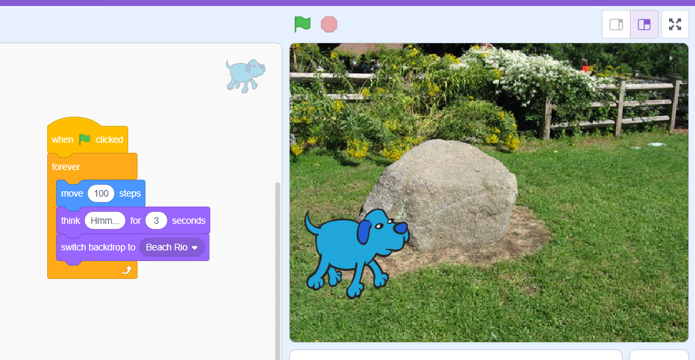
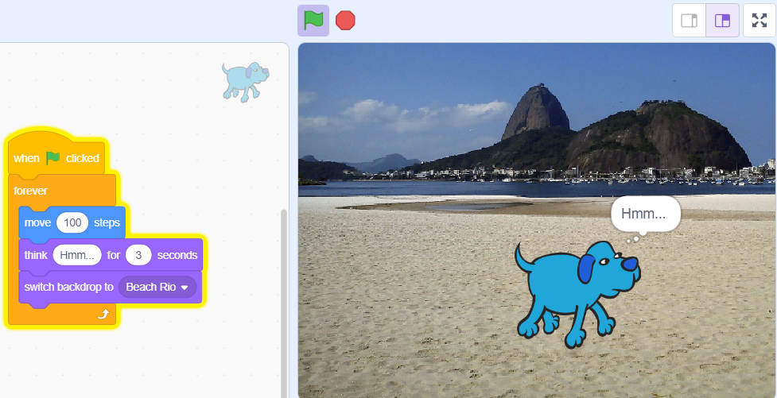
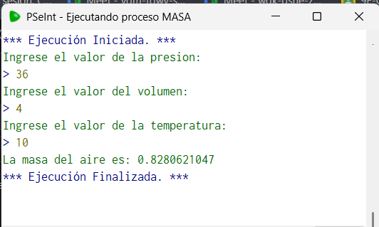
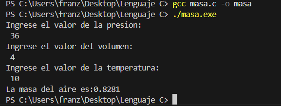
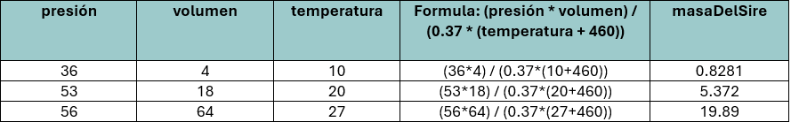
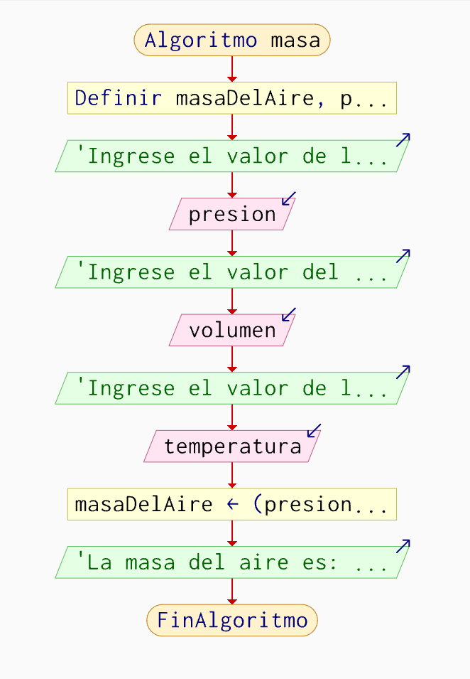

# 🧩 Unidad 1 — Algoritmos y Estructuras Secuenciales  

---

### 📘 Contenidos de la Unidad
- **Conceptos básicos:** Algoritmos, pseudocódigo , diagramas de flujo , lenguaje de programacion C y pruebas de escritorio.  
- **Programación por bloques.**  
- **Ejemplos con estructuras lineales/secuenciales.**  
- **Dificultades encontradas.**  
- **Reflexión crítica sobre los aprendizajes.**  

---

<h2>🔹 Algoritmos, Pseudocódigo y Diagrama de Flujo</h2>

📄 **Definiciones y explicación:**  

---

### 🧠 1.1. Algoritmos
Un algoritmo puede entenderse como una serie de pasos ordenados que permiten resolver un problema o realizar una tarea específica.  

Según **Guevara Lezama [1]**, se trata de “un conjunto de pasos finitos, precisos y bien definidos para la resolución de problemas”.  
De forma similar, **Pacheco Patiño [2]** señala que un algoritmo es una secuencia detallada de instrucciones que orientan al programador en la solución de una tarea concreta.  

Para que un algoritmo esté bien escrito debe tener algunas características: deben ser **claros, finitos y ordenados**.  
Además, deben garantizar que, con los mismos datos de entrada, siempre se obtenga el mismo resultado.  

En la práctica, esto significa que el algoritmo debe describir el proceso de forma exacta, sin dejar lugar a dudas ni interpretaciones.  

El algoritmo puede escribirse de distintas formas: en **lenguaje natural**, en **pseudocódigo** o mediante **diagramas de flujo**, dependiendo de qué tan visual o estructurada se quiera la representación [2].  

---

### ✏️ 1.2. Pseudocódigo
El pseudocódigo es una herramienta muy útil para representar la lógica de un algoritmo sin tener que usar un lenguaje de programación real.  

**Pacheco Patiño [2]** lo describe como “un lenguaje artificial e informal que ayuda a los programadores a desarrollar algoritmos”.  

En otras palabras, es una forma fácil de escribir un algoritmo, ya que utiliza un lenguaje natural (como el español), que te permite enfocarte en el *qué* y el *cómo* sin seguir las reglas técnicas de un lenguaje de alto nivel como Python o C++.  
Sin embargo, este intenta parecerse a la estructura y sintaxis de los mismos.  

**Guevara Lezama [1]** resalta que el pseudocódigo permite concentrarse en la lógica del problema, lo cual facilita su traducción al lenguaje de programación.  

Además, tiene la ventaja de ser **fácil de leer**, **independiente del lenguaje de programación** y **adaptable a cualquier contexto**.  

---

### 🔶 1.3. Diagramas de Flujo
Los diagramas de flujo permiten representar de forma gráfica los pasos de un algoritmo.  

Como lo dicen **Patiño Martínez, Torres Londoño y Chica Sosa [3]**, son “una técnica gráfica que se utiliza para diseñar algoritmos y representar secuencias de rutinas y procesos de cualquier índole”.  

Esta representación se apoya en símbolos estandarizados por la **norma ISO 5807:1985** y la **ANSI**, que facilitan la lectura y comprensión del proceso, incluso para quienes no son programadores.  

**Algunos símbolos básicos son:**
- **Óvalo:** marca el inicio o el fin.  
- **Rectángulo:** representa una acción o proceso.  
- **Paralelogramo:** indica entrada o salida de datos.  
- **Rombo:** se usa para decisiones o condiciones.  
- **Flechas:** muestran la dirección del flujo de control.  

<small>Los diagramas de flujo ayudan a visualizar la estructura del programa y a detectar posibles errores antes de escribir el código.  
Son una excelente herramienta didáctica, ya que combinan la lógica del pensamiento con la claridad del diseño visual [3].</small>

---

<h2>🔹 Programación por Bloques</h2>

## 📄 Conceptos  

---

### 🪄 Introducción
Para muchas personas, comenzar a programar puede resultar complicado debido a la cantidad de reglas y símbolos que requieren los lenguajes tradicionales.  

La **programación por bloques** surge como una solución a este problema. Su objetivo principal es hacer más fácil el primer acercamiento a la programación, permitiendo que los estudiantes se centren en cómo resolver problemas antes de aprender la sintaxis de un lenguaje de código [1].  

---

### 🧩 ¿Qué es la Programación por Bloques?
La programación por bloques es formar algoritmos mediante piezas visuales, como si fuera un rompecabezas, que representan acciones o instrucciones.  

Para crear un programa o algoritmo, una persona solo debe arrastrar y unir estos bloques siguiendo un orden lógico.  
Estos bloques están diseñados para encajar entre sí de forma lógica, evitando errores [1].  

Por ejemplo, si usamos la aplicación **Scratch**, los bloques están divididos por colores y acciones específicas como *mover*, *aparecer*, *emitir sonido*, etc. [2].  

Además, herramientas como Scratch permiten combinar código visual con imágenes, sonidos, personajes y animaciones, lo que motiva a los estudiantes a crear proyectos interactivos y creativos.  

---

### 🌟 Ventajas de la Programación por Bloques
Entre las principales ventajas se encuentran:

- **Aprendizaje fácil y directo.**  
  Los estudiantes comprenden más rápido las ideas centrales de la programación porque pueden ver de forma visual cómo se construye una solución.  
  Esto es útil para enseñar a los niños programación [1].

- **Evita frustraciones.**  
  Al no existir errores de sintaxis, los estudiantes pueden concentrarse en el razonamiento y no en detalles técnicos del lenguaje [1].

- **Creatividad.**  
  Actividades con bloques suelen ser percibidas como divertidas y permiten crear juegos, animaciones o historias, lo cual hace que el aprendizaje se vuelva fácil y atractivo [2].  

---

### ⚠️ Desventajas y Dificultades
Sin embargo, también existen algunas limitaciones:

- **Complejidad creciente.**  
  Aunque es útil para iniciar, muchos estudiantes encuentran más difícil aplicar estructuras como las condiciones o repeticiones más avanzadas cuando el nivel de dificultad aumenta [1].

- **No siempre es suficiente para proyectos complejos.**  
  Algunas tareas requieren manejar hardware, operadores o estructuras más técnicas, y no todos los estudiantes logran dominarlas fácilmente dentro de estos entornos [2].  

---

<h2>🔹 Lenguaje de programacion C </h2>

## 💻 ** Lenguaje de Programación C**

Según el documento **“Lenguaje de Programación C”**, el lenguaje **C** es un **lenguaje de programación estructurado y de nivel medio**, creado por **Brian Kernighan** y **Dennis Ritchie** en los años 70.  

Combina las características de los **lenguajes de alto nivel** con la **eficiencia del lenguaje ensamblador**.  

Su diseño busca ser **simple, flexible y portable**, permitiendo que los programas escritos puedan **adaptarse a distintos tipos de computadoras**.

---

<h2>🧮 Pruebas de Escritorio</h2>

---

### 🧩 **Definición**

Las **pruebas de escritorio**, también conocidas como **pruebas estáticas** o **pruebas de caja blanca**, son una **técnica fundamental en el proceso de desarrollo de software**.  

Consisten en un análisis **manual del código o del algoritmo**, donde se **evalúa su comportamiento sin ejecutarlo**, con el fin de detectar errores lógicos, de flujo o de diseño antes de la implementación.

---

📄 **Definiciones y explicación:**  
 
## 🧪 Ejemplos Prácticos  

| Descripción | Archivo / Imagen |
|-------------|-----------------|
| 

<b>Programación por bloques en Scratch (Parte 1)</b>
 En este primer ejemplo, se eligió el bloque de **evento** (color amarillo) “al presionar la bandera verde”. Luego se añadió un bloque de **control** (color anaranjado) “por siempre”. Dentro de este, se incorporaron los bloques de **movimiento** (color azul) “mover 100 pasos” y dos bloques de **apariencia** (color morado): el primero “pensar Hmm durante 3 segundos” y el segundo “cambiar fondo a Beach Río”.
 |  |
| 

<b>Programación por bloques en Scratch (Parte 2)</b>
 Tras construir los bloques, se ejecutó el programa. Al iniciarse, se observa cómo el personaje cambia el fondo del escenario: primero aparece un paisaje de flores y luego uno de playa.
 |  |
| 

<b>Algoritmo en pseudocódigo – Cálculo de la masa del aire</b>
 1️⃣ Se definieron las variables **masaDelAire**, **presion**, **volumen** y **temperatura** como tipo *Real*. 2️⃣ Se solicitaron los valores mediante el comando **Escribir** y se leyeron con **Leer**. 3️⃣ Se aplicó la fórmula correspondiente para calcular la masa del aire. 4️⃣ Finalmente, se mostró el resultado, cuidando la sintaxis y el orden lógico del pseudocódigo.
 | [📄 algoritmo_masa.psc](unidad1/masa.psc) |
| 

<b>Prueba de escritorio en PSeInt</b>
 Representa la ejecución paso a paso del pseudocódigo, verificando que los resultados coincidan con la lógica planteada.
 |  |
| 

<b>Algoritmo en C – Cálculo de la masa del aire</b>
 1️⃣ Se creó el archivo con extensión **.c** y se incluyó la librería estándar `#include <stdio.h>`. 2️⃣ Se definió la función principal `main()` y las variables como tipo *float*. 3️⃣ Se solicitó al usuario ingresar los valores con **printf**, y se capturaron con **scanf**, utilizando las máscaras y referencias adecuadas. 4️⃣ Se aplicó la fórmula correspondiente para el cálculo. 5️⃣ Finalmente, se mostró el resultado en pantalla mediante **printf**.
 | [💻 algoritmo_masa.c](unidad1/algoritmo_masa.c) |
| 

<b>Prueba de escritorio en C</b>
 Muestra la compilación y ejecución del programa, verificando que los resultados sean correctos.
 |  |
| 

<b>Prueba de escritorio manual</b>
 Ejemplo del procedimiento lógico desarrollado paso a paso antes de ejecutar el código en el computador.
 |  |
| 

<b>Diagrama de flujo del algoritmo</b>
 Representación visual del proceso de cálculo de la masa del aire, donde se aprecian las entradas, operaciones y salidas.
 |  |

---

## ⚠️ Principales Dificultades Detectadas
Una de las dificultades más frecuentes fue **traducir el razonamiento lógico al código**, especialmente al declarar variables, utilizar correctamente operadores y respetar la **sintaxis** del lenguaje.  
También se presentaron errores por el uso incorrecto de símbolos y delimitadores.  

---

## 💭 Reflexión Crítica
Durante esta unidad comprendí que programar es, ante todo, **pensar de manera lógica y organizada**.  
El uso del pseudocódigo permite estructurar ideas, definir datos y planificar soluciones antes de escribir código. Además, realizar **pruebas de escritorio** ayuda a identificar errores sin necesidad de ejecutar el programa.  

Siento que trabajé bien al identificar errores y comprender el funcionamiento de las instrucciones. Sin embargo, aún debo mejorar la **traducción del pseudocódigo a un lenguaje de programación**, especialmente en cuanto a sintaxis y selección de sentencias adecuadas.  

---

## 📚 Tareas entregadas  
## 📚 Tareas entregadas  

| Nº | Actividad | Descripción | Enlace |
|----|------------|-------------|--------|
| 1️⃣ | 🧩 **Herramientas de algoritmos** | Pseudocódigo y diagramas de flujo | [Ver Tarea 1](https://drive.google.com/file/d/1r_Qpz6qW0wUK3Sd-qUcKzpLrpNokYlvD/view?usp=sharing) |
| 2️⃣ | 💻 **Instalación de lenguajes** | C, Python o Java | [Ver Tarea 2](https://drive.google.com/file/d/1Jc6zVyShcyrnG4cg1bK00uLtHNyj8kfi/view?usp=sharing) |
| 3️⃣ | 🧠 **Primer acercamiento** | Construcción de algoritmos secuenciales | [Ver Tarea 3](https://drive.google.com/file/d/1SLboYDiEZJBnluvBBm8XdPh35Owha0Zo/view?usp=sharing) |
| 4️⃣ | ⚙️ **Del diseño al programa** | Del algoritmo a la construcción del código | [Ver Tarea 4](https://drive.google.com/file/d/111MfQ9oO4RabY0mmf6SDrkK2UgdKd1D-/view?usp=sharing) |
---

> 🌸 *Unidad completada con dedicación, lógica y creatividad.*  

---

✨ *Fin de la Unidad 1* ✨  

